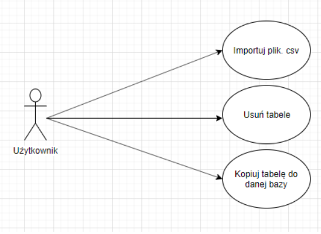
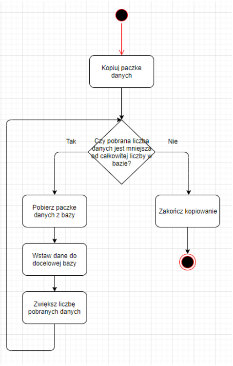
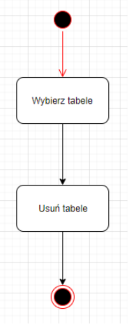
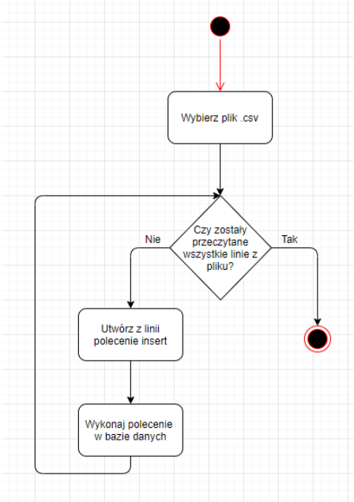
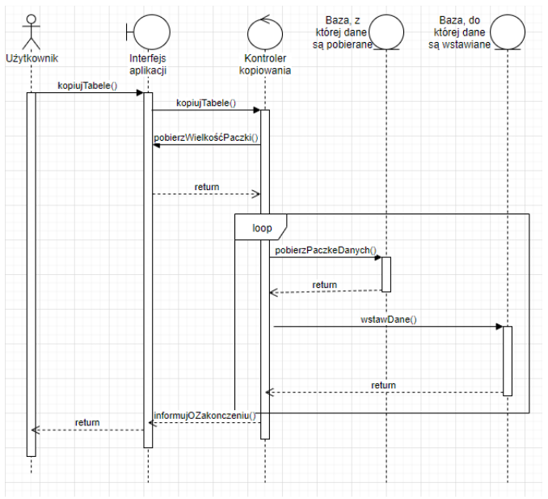

# Dokumentacja projektu: Aplikacja testująca wydajność przenoszenia danych między bazami ClickHouse i Firebird 

- [Zespół projektowy](#zespół-projektowy)
- [Specyfikacja projektu](#specyfikacja-projektu)
- [Cel i zakres projektu](#cel-i-zakres-projektu)
- [Opis interfejsu użytkownika](#opis-interfejsu-użytkownika)
- [Wymagania](#wymagania)
- [Zalecenia](#zalecenia)
- [Przepływ informacji w środowisku systemu](#przepływ-informacji-w-środowisku-systemu)
- [Diagramy UML](#diagramy-uml)
- [Baza danych](#baza-danych)
- [Importowanie pliku CSV](#importowanie-pliku-csv)
- [Wykorzystane technologie](#wykorzystane-technologie)

##	Zespół projektowy

| Imię i nazwisko | Zakres czynności |
| -------------   | ------------- | 
| Jakub Gurgacz   | Programowanie | 
| Damian Rolewski | Dokumentacja | 
| Tomasz Baran    | Dokumentacja |
| Tomasz Kośmidek | Dokumentacja |

## Specyfikacja projektu

### Cel i zakres projektu

Aplikacja będzie miała za zadanie, aby w prosty sposób obsłużyć komunikacji pomiędzy dwoma silnikami bazodanowymi. 

W aplikacji będzie można m.in.:
* dodać dane z pliku,
* usuwanie danych,
* przenoszenie danych z jednej bazy do drugiej.

### Opis interfejsu użytkownika

 <b>Sekcja Firebird</b>
1.	Wybieranie pliku do importu do bazy Firebird. Po wybraniu użytkownik zostanie poproszony o podanie nazwy dla tabeli, do której zostanie dany plik zaimportowany oraz typów danych.

2.	Wybór tabeli, która ma zostać skopiowana do bazy ClickHouse. Po wybraniu użytkownik zostanie poproszony o usunięcie tabeli z bazy ClickHouse, tylko w wypadku, jeśli tabela o danej nazwie już tam istnieje.

3.	Ilość danych, z Firebird, jaka ma być na raz zapisana do bazy ClickHouse.

4.	Przycisk do rozpoczęcia kopiowania wybranej tabeli.

5.	Przycisk do usuwania wybranej tabeli z bazy Firebird.

___

<b> Sekcja ClickHouse </b>

6.	Wybieranie pliku do importu do bazy ClickHouse. Po wybraniu użytkownik zostanie poproszony o podanie nazwy dla tabeli, do której zostanie dany plik zaimportowany oraz typów danych.

7.	Wybór tabeli, która ma zostać skopiowana do bazy Firebird. Po wybraniu użytkownik zostanie poproszony o usunięcie tabeli z bazy Firebird, tylko w wypadku, jeśli tabela o danej nazwie już tam istnieje.

8.	Ilość danych, z ClickHouse, jaka ma być na raz zapisana do bazy Firebird.

9.	Przycisk do rozpoczęcia kopiowania wybranej tabeli.

10.	Przycisk do usuwania wybranej tabeli z bazy ClickHouse.

___

<b> Brak sekcji </b>

11.	 Pole z logami aplikacji.

___
### Wymagania 

Jako, że aplikacja skupia się na testowaniu wydajności systemów bazodanowych, dane powinny być spójne, żeby aplikacja mogła działać poprawnie.

___

### 	Zalecenia

Pierwsza linia w pliku .csv jest odczytywana jako nazwy dla kolumn w tabeli, która zostanie utworzona dla danych z pliku.

Po zakończonej operacji, w którą zaangażowana była baza Firebird, zaleca się aby od nowa uruchomić aplikację. 

Jest to spowodowane tym, że baza Firebird, pomimo zakończenia operacji, przy próbie wykonania następnej operacji, Firebird podaje komunikat, że wcześniejsza operacja nie została jeszcze zakończona. 

___

### Przepływ informacji w środowisku systemu

Przepływ informacji będzie odbywał się za pomocą bazy danych i serwera. 

Aplikacja za pomocą paneli będzie miała możliwość wysyłania i odbierania zapytań bazodanowych.

___

## Diagramy UML

### Diagram przypadków użycia 

### Diagram aktywności
#### Kopiowanie danych

#### Usuwanie tabeli

#### Importowanie pliku .csv

### Diagram sekwencji

##	Baza danych
###	Firebird
Plik bazy danych Firebird powinien znajdować się w lokalizacji „C:\fbDB\database.fdb”. Serwer powinien być udostępniony na hoście localhost na porcie 3050. Nazwa użytkownika do bazy SYSDBA z hasłem password. Aplikacja testowana z wersją Firebird 3.0.4. Możliwe działanie z innymi podwersjami 3.0 niewykluczone. Wersje wcześniejsze niż 3.0 nie będą działać ze względu na użyte funkcje dostępne tylko od wersji 3.0.
###	ClickHouse
Serwer bazy ClickHouse powinien się znajdować na hoście localhost na porcie 8123. Nazwa użytkownika bazy default bez hasła. Aplikacja testowana z bazą w wersji 19.17.2. Działanie 
z innymi wersjami niewykluczone.

## Importowanie pliku CSV

Baza ClickHouse wykonuje import pliku .csv w czasie około 9 minut.

___

Baza FireBird natomiast wykonuje ten import w dużo większym czasie - w ponad 30 minut. 

##	Wykorzystane technologie
- <b>Język Java 8</b>
  -	Główny język wykorzystany do napisania aplikacji. 
- <b>JavaFX</b>
  -	Narzędzie do tworzenia graficznego interfejsu użytkownika.
- <b>Baza danych ClickHouse</b>
  -	Baza danych, w której będą przechowywane informacje potrzebne do poprawnego działania aplikacji.
- <b>Baza danych FireBird</b>
  -	Baza danych, w której będą przechowywane informacje potrzebne do poprawnego działania aplikacji.
- <b>Scene Builder</b>
  -	Użyty do zaprojektowania interfejsu użytkownika
- <b>Maven</b>
  -	Umożliwia kompilowanie projektu bez konieczności dostarczania plików .jar potrzebnych do kompilacji.
- <b>Hibernate</b>
  -	Służy do mapowania obiektowo-relacyjnego
- <b>Dia</b>
  -	Projektowanie diagramów UML
- <b>Draw.io</b>
  -	Projektowanie diagramu ERD

